# Draw a Shape Feature Extraction
## Feature extraction for smartphone-based touchscreen drawing assesments
Software detailing the extraction of smartphone touch screen drawing features from the Draw a Shape test, assesed as part of the Floodlight PoC app for people with multiple sclerosis (PwMS).

<p float="center">
  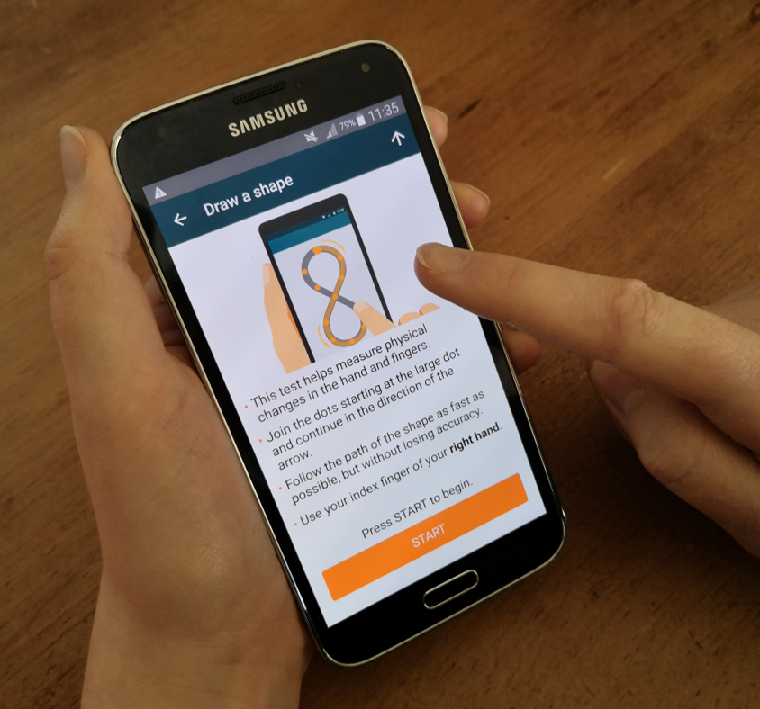
  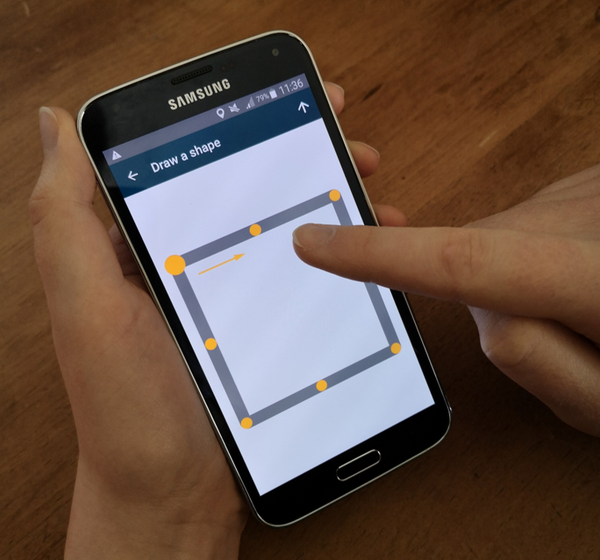 
  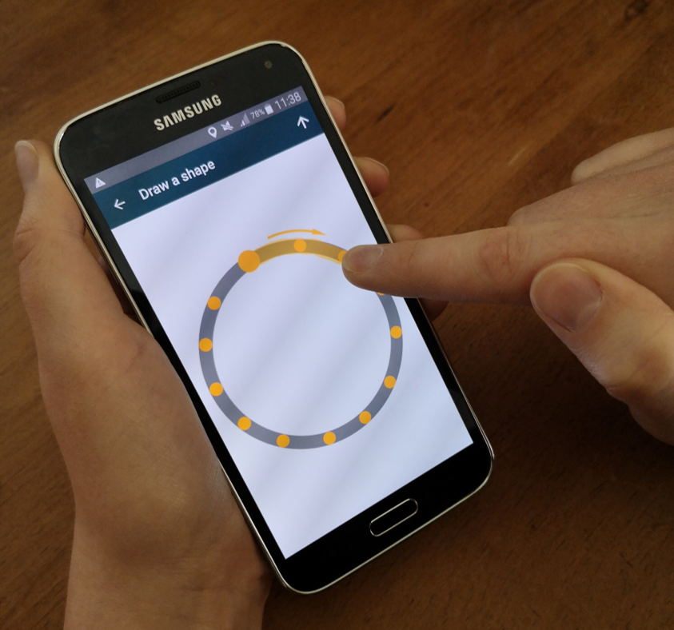
  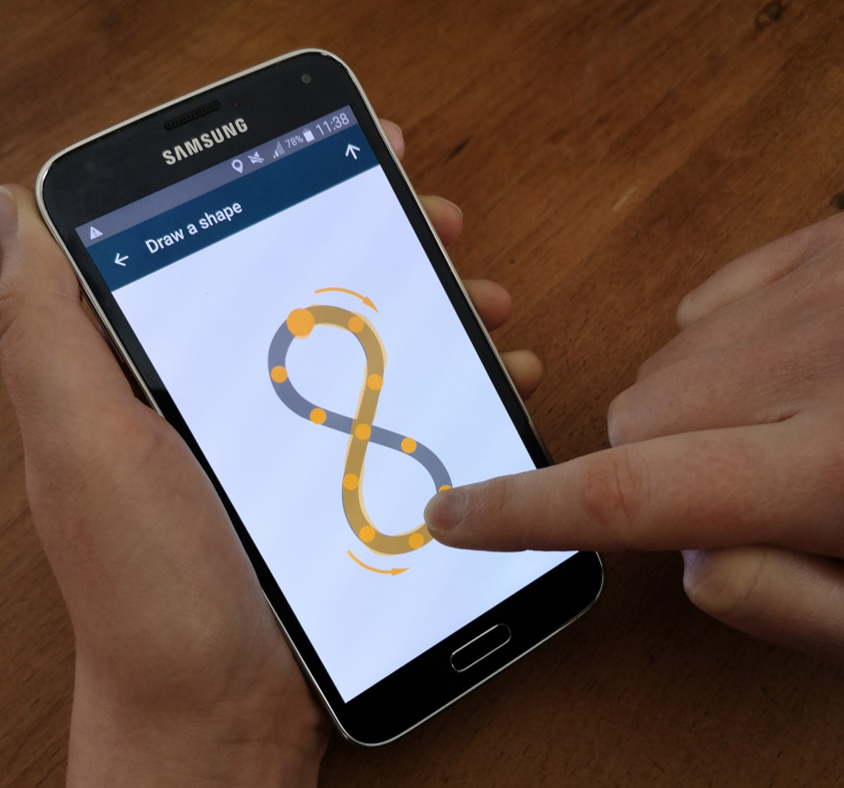
  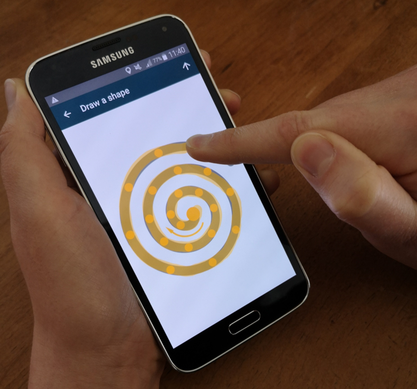
  <b>Figure -</b>
  <em>Demonstration of the Floodlight PoC "Draw a Shape" test performed by a healthy participant using a smartphone. Each participant was instructed to draw six different shapes presented on the smartphone screen as fast and as accurate as possible, within a maximum time of 30 seconds per each attempted shape: a diagonal line bottom left to top right and a diagonal line top right to bottom left (not depicted), a square, a circle, afigure-8-shape, and a spiral.</em>
</p>

## The Draw a Shape Assesment
 The Floodlight Proof-of-Concept (PoC) app was designed to remotely measure, at home in an unsupervised setting, functional ability in people with with multiple sclerosis (PwMS). The study “Monitoring of Multiple Sclerosis Participants With the Use of Digital Technology (Smartphones and Smartwatches)—A Feasibility Study” (NCT02952911) was the first clinical trial to implement the Floodlight PoC app. <br>
The Draw a Shape Test required participants to draw six prewritten shapes of increasing complexity (two diagonal lines, a square, circle, a figure-of-8, and a spiral), in order to assess fine finger or manual dexterity. For more information on the Floodlight PoC app, please see [2]. 

## Citation
If using this framework, please consider citing our work:

DOI: [10.1088/1361-6579/ab8771 ](https://doi.org/10.1088/1361-6579/ab8771)
```
@article{creagh2020smartphone,
  title={Smartphone-based remote assessment of upper extremity function for multiple sclerosis using the Draw a Shape Test},
  author={Creagh, AP and Simillion, C and Scotland, A and Lipsmeier, F and Bernasconi, C and Belachew, S and van Beek, J and Baker, M and Gossens, C and Lindemann, M and others},
  journal={Physiological measurement},
  volume={41},
  number={5},
  pages={054002},
  year={2020},
  publisher={IOP Publishing}
}
```

The codebase demonstrates how to perform modular, scalable and parallelizable draw a shape feature extraction from smartphone touch screen sensor data. 
# Draw a Shape Feature Extraction Codebase

## Repository Structure 
  
    ├── /data/                        # example data  
    ├── /docs/                        # documentation files 
    ├── /features/                    # feature files 
    ├── /img/                         # images 
    ├── /src/                         # source files 
    │   ├── featureExtraction.m       # feature extraction wrapper file
    │   ├── /feature_extraction/      # feature extraction functions 
    │   └── /functions/               # ancillary/helper functions
    ├── example.m                     # tutorial file 
    ├── LICENSE
    └── README.md
## Dependencies 
- MATLAB R2020b (v9.9)                              
- Signal Processing Toolbox (v8.5)             
- Image Processing Toolbox (v11.2)             
- Statistics and Machine Learning Toolbox (v12.0)
- Wavelet Toolbox (v5.5)      

## Running the Code
See **`example.m`** for a tutorial on how to implement use this feature extraction code. Briefly, running the **`featureExtraction.m`** function will extract features across various domains, which can be loosely grouped into (1) temporal, (2) spatial, and (3) spatio-temporal feature domains. 
```matlab
%%---------------Feature Extraction----------------------%
%shapeData: a cell containing the shape data and information. 
%shape: (string) shape name, e.g. 'SPIRAL"
%extra_options: structure containing optional inputs to be used in each feature extraction function.
[features, feature_names] = featureExtraction(shapeData, shape, extra_options);
```
# Feature Extraction Examples
Multiple features were extracted from each shape capturing temporal, spatial and spatiotemporal aspects involved in the drawing task and potentially respective of manual dexterity. Some visual examples of features are demonstrated in the figures below. For more information on the features, see our paper [1] as well as other excellent reference for features which we adapted in our work [3-6]. 

## Temporal Feature Example(s)
<p float="center">
  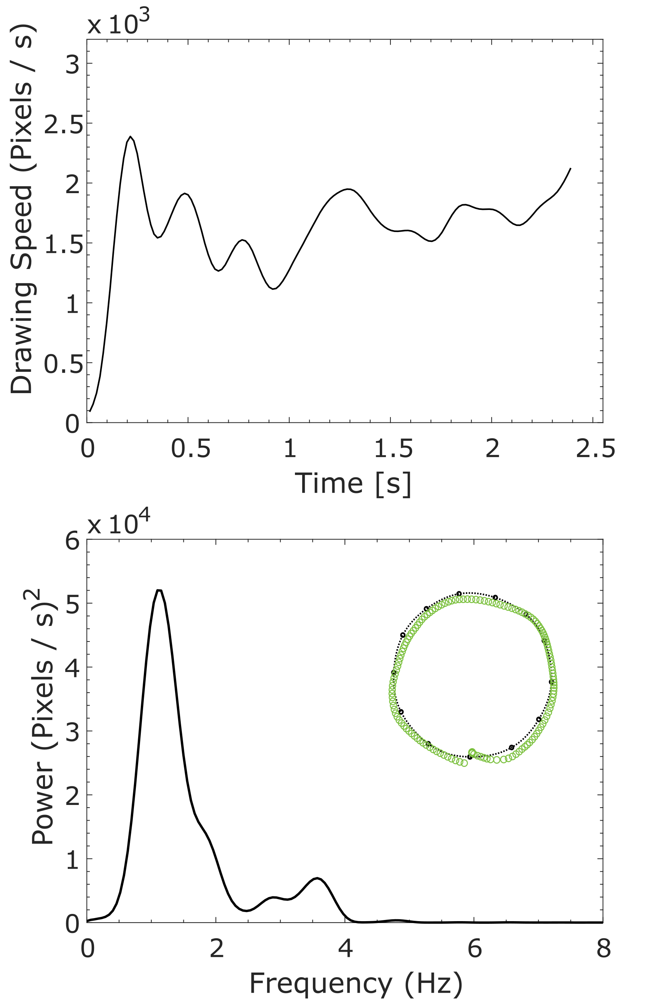
  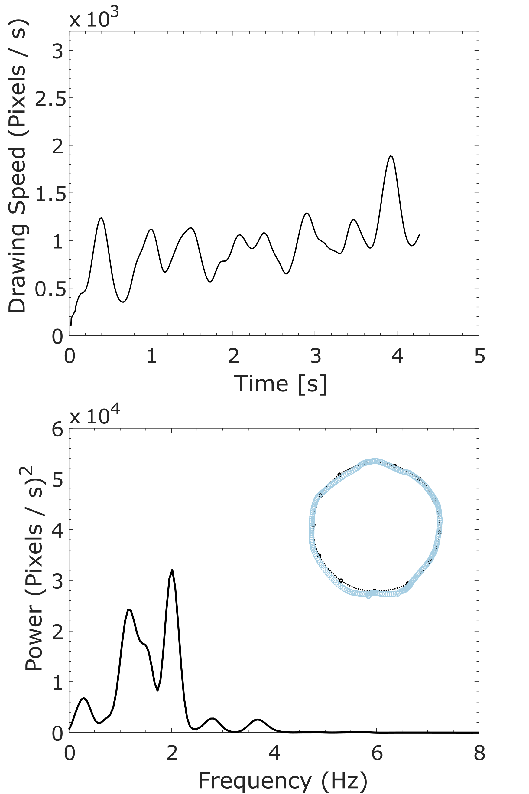
  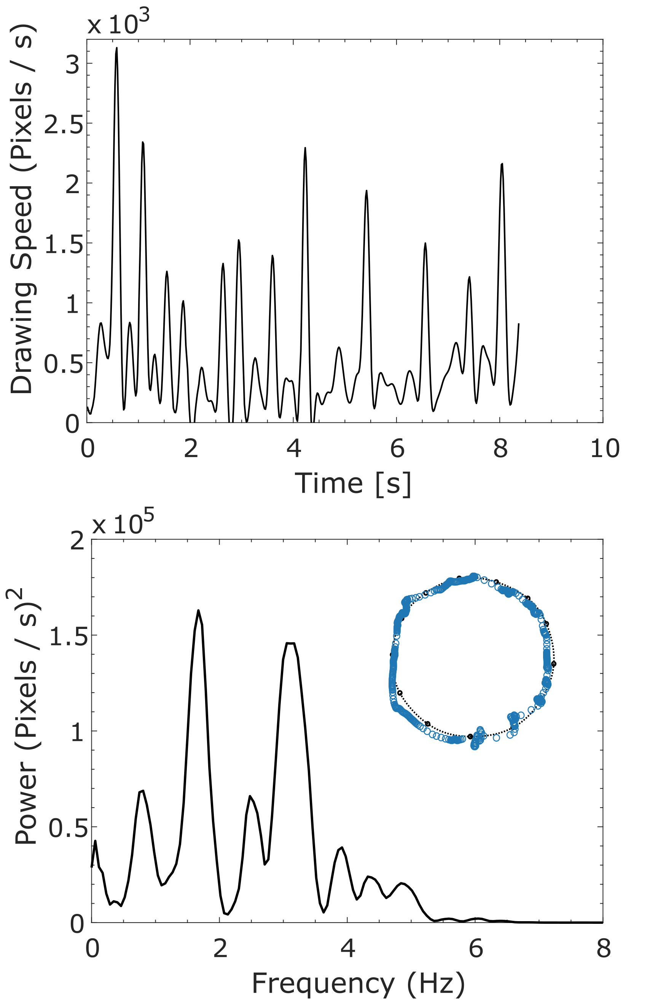
  <b>Figure -</b> <em> Example illustrations of circle shape drawn by (L-R): healthy control (HC) PwMS (no apparent upper extremity dysfunction), and aPwMS (abnormal upper extremity function) subjects. Red points depict actual pixel points drawn relative to interpolated reference coordinates (black). The top row demonstrates examples of drawing speed for duration of time to draw each respective shape. Time series speed signal was firstfiltered using a low pass filter with a cut off frequency of 8 Hz. The bottom row represents the power spectral density (PSD) estimate of drawing speed which was computed using a Hamming window. Note
the time and PSD axis scale between the figures. </em>
</p>

## Spatial Feature Example(s)
<p float="center">
  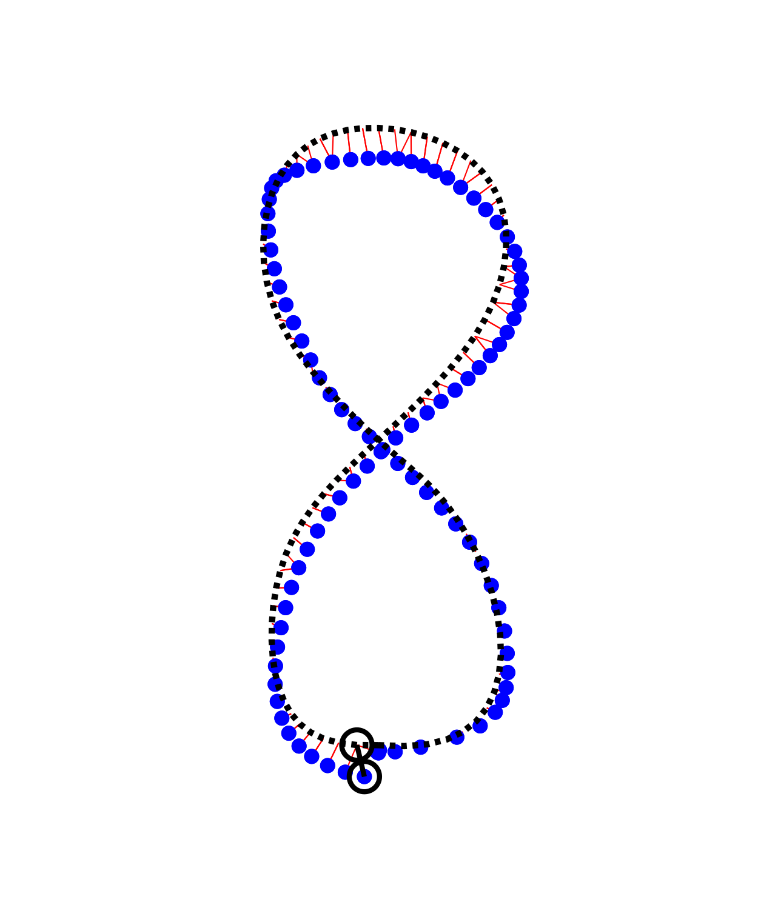
  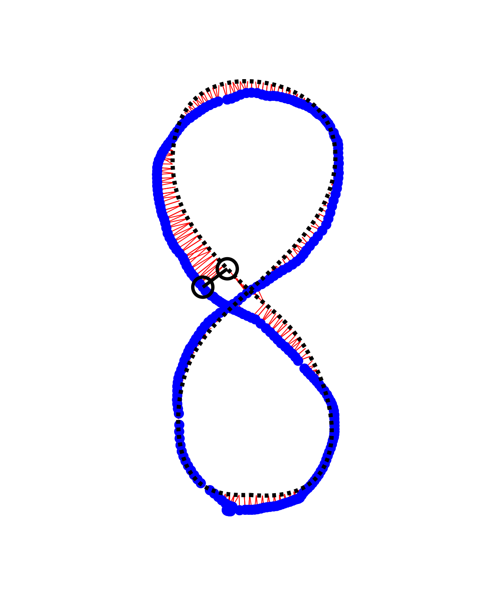
  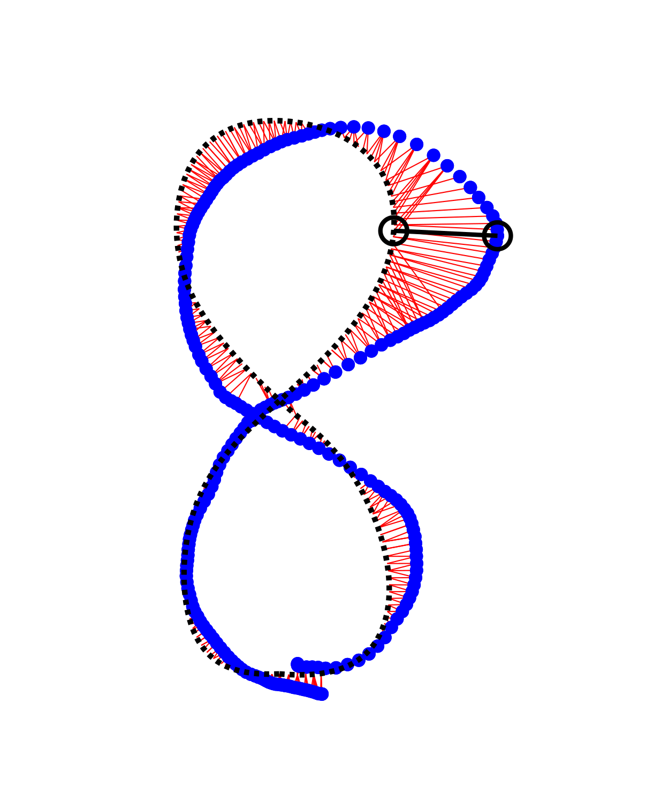
  <b>Figure -</b> <em> Examples of figure-8-shapes drawn by (L-R): healthy control (HC) PwMS (no apparent upper extremity dysfunction), and aPwMS (abnormal upper extremity function) subjects. Figure depicts actual pixel points drawn (blue) relative to interpolated reference coordinates (black). Hausdorff Distance query points are illustrated with red lines and maximal Hausdorff Distances (HausD, as measured in Pixels) are highlighted with black circles; HC (64 Pixels) , nPwMS (90 Pixels), aPwMS (229 Pixels). The total drawing error (HausDError) can also be defied as sum of the Hausdorff distances (i.e. the largest minimum
distances) between the drawn and reference shape, normalized by the number of touch coordinates drawn. </em>
</p>

## Spatiotemporal Feature Example(s)
<p float="center">
  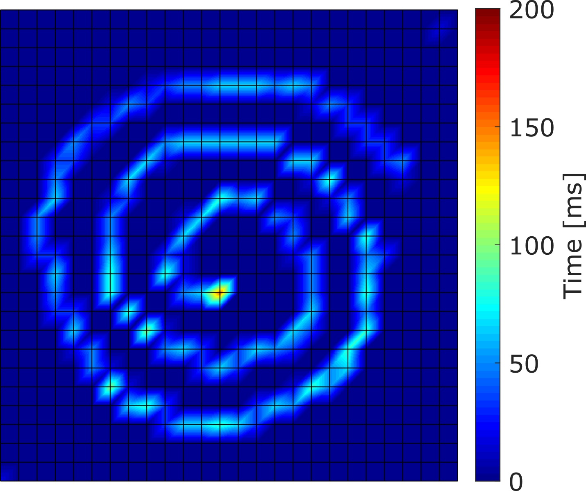
  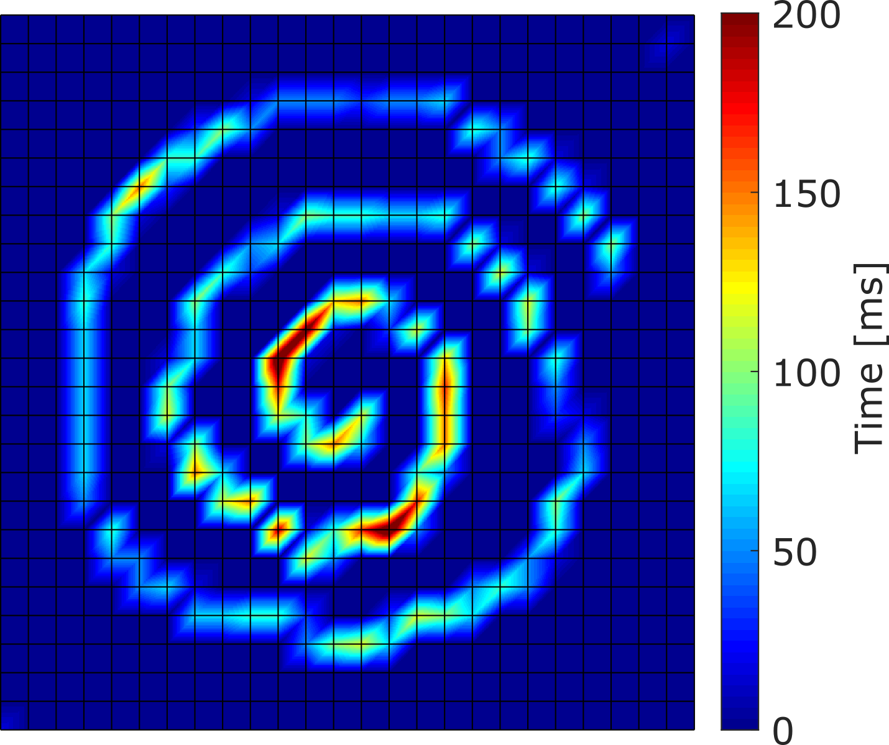
  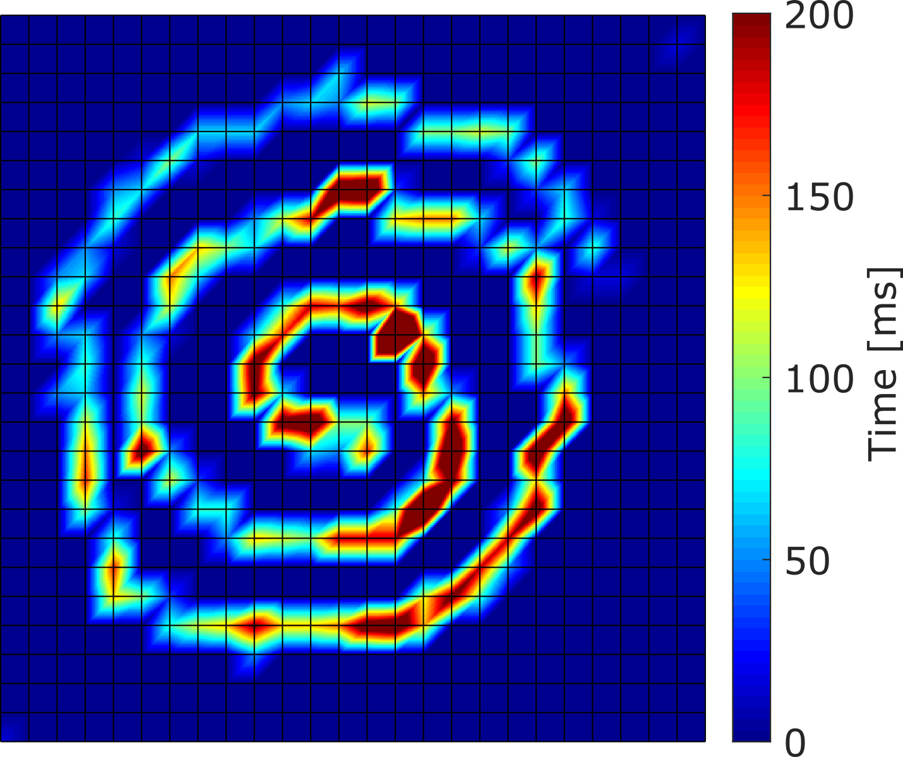
  <b>Figure -</b> <em>  Pixel density heat map representation of spiral shapes drawn (L-R): healthy control (HC) PwMS (no apparent upper extremity dysfunction), and aPwMS (abnormal upper extremity function) subjects. Screen coordinates are first segmented into 2D bins of xed width and drawing touch point coordinates are assigned to respective bins. The number of touch coordinates per bin, and hence time, are represented by heat map colour. This builds a spatio-temporal representation of digital spiral drawing which encode areas of drawing hesitation or non-movements. </em>
</p>

# References:
1. Creagh, A.P., Simillion, C., Scotland, A., Lipsmeier, F., Bernasconi, C., Belachew, S., van Beek, J., Baker, M., Gossens, C., Lindemann, M. and De Vos, M., 2020. Smartphone-based remote assessment of upper extremity function for multiple sclerosis using the Draw a Shape Test. Physiological measurement, 41(5), p.054002. https://doi.org/10.1088/1361-6579/ab8771 
1. Montalban, X., Graves, J., Midaglia, L., Mulero, P., Julian, L., Baker, M., Schadrack, J., Gossens, C., Ganzetti, M., Scotland, A. and Lipsmeier, F., 2021. A smartphone sensor-based digital outcome assessment of multiple sclerosis. Multiple Sclerosis Journal, p.13524585211028561. https://doi.org/10.1177/13524585211028561
1. M. Memedi, A. Sadikov, V. Groznik, J. Zabkar, M. Mozina, F. Bergquist,
A. Johansson, D. Haubenberger, and D. Nyholm. 2015. Automatic spiral analysis for objective assessment of motor symptoms in parkinson's disease. Sensors (Basel), 15(9):23727{44}.  https://doi.org/10.3390/s150923727
1. Somayeh Aghanavesi, Dag Nyholm, Marina Senek, Filip Bergquist, and Mevludin Memedi. 2007. A smartphone-based system to quantify dexterity in parkinson's disease patients. Informatics in Medicine Unlocked, 9:11{17, 2017.P. Feys, W. Helsen, A. Prinsmel, S. Ilsbroukx, S. Wang, and X. Liu. Digitised spirography as an evaluation tool for intention tremor in multiple sclerosis. J.Neurosci Methods, 160(2):309{16}.  https://doi.org/10.1016/j.jneumeth.2006.09.019
1. Mitchell Grant Longsta and Richard A Heath. Spiral drawing performance as an indicator of fine motor function in people with multiple sclerosis. 2006. Human movement science, 25(4):474{491}. https://doi.org/10.1016/j.humov.2006.05.005
1. Lutz-Peter Erasmus, Stefania Sarno, Holger Albrecht, Martina Schwecht, Walter Pollmann, and Nicolaus Konig. 2001. Measurement of ataxic symptoms with a graphic tablet: standard values in controls and validity in multiple sclerosis patients. Journal of Neuroscience Methods, 108(1):25{37}. https://doi.org/10.1016/s0165-0270(01)00373-9 

# License
The current version of this repository is released under the GNU General Public License v3.0 unless otherwise stated. The author of the repository retains his respective rights. The published paper is governed by a separate license and the authors retain their respective rights.

# Disclaimers
### Disclaimer of Warranty<br>
THERE IS NO WARRANTY FOR THE PROGRAM, TO THE EXTENT PERMITTED BY APPLICABLE LAW.  EXCEPT WHEN OTHERWISE STATED IN WRITING THE COPYRIGHT HOLDERS AND/OR OTHER PARTIES PROVIDE THE PROGRAM "AS IS" WITHOUT WARRANTY OF ANY KIND, EITHER EXPRESSED OR IMPLIED, INCLUDING, BUT NOT LIMITED TO, THE IMPLIED WARRANTIES OF MERCHANTABILITY AND FITNESS FOR A PARTICULAR PURPOSE.  THE ENTIRE RISK AS TO THE QUALITY AND PERFORMANCE OF THE PROGRAM IS WITH YOU.  SHOULD THE PROGRAM PROVE DEFECTIVE, YOU ASSUME THE COST OF ALL NECESSARY SERVICING, REPAIR OR CORRECTION.

### Limitation of Liability<br>
IN NO EVENT UNLESS REQUIRED BY APPLICABLE LAW OR AGREED TO IN WRITING WILL ANY COPYRIGHT HOLDER, OR ANY OTHER PARTY WHO MODIFIES AND/OR CONVEYS THE PROGRAM AS PERMITTED ABOVE, BE LIABLE TO YOU FOR DAMAGES, INCLUDING ANY GENERAL, SPECIAL, INCIDENTAL OR CONSEQUENTIAL DAMAGES ARISING OUT OF THE USE OR INABILITY TO USE THE PROGRAM (INCLUDING BUT NOT LIMITED TO LOSS OF DATA OR DATA BEING RENDERED INACCURATE OR LOSSES SUSTAINED BY YOU OR THIRD PARTIES OR A FAILURE OF THE PROGRAM TO OPERATE WITH ANY OTHER PROGRAMS), EVEN IF SUCH HOLDER OR OTHER PARTY HAS BEEN ADVISED OF THE POSSIBILITY OF SUCH DAMAGES.
